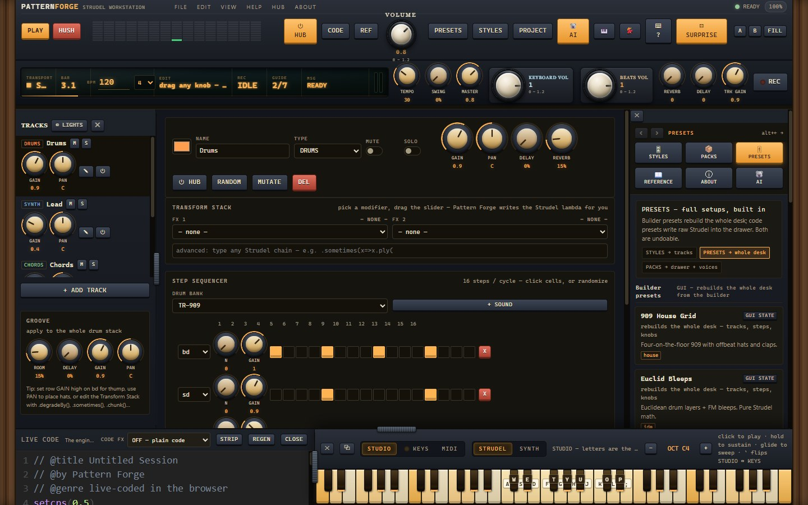
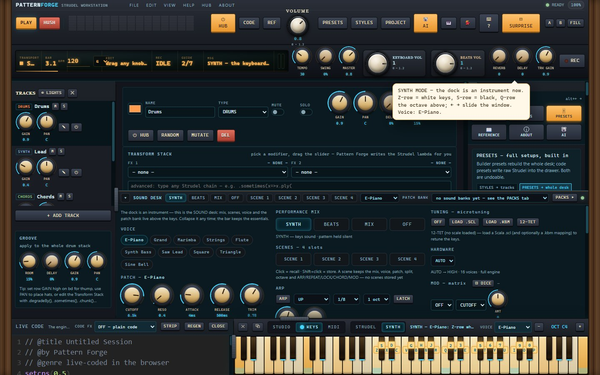
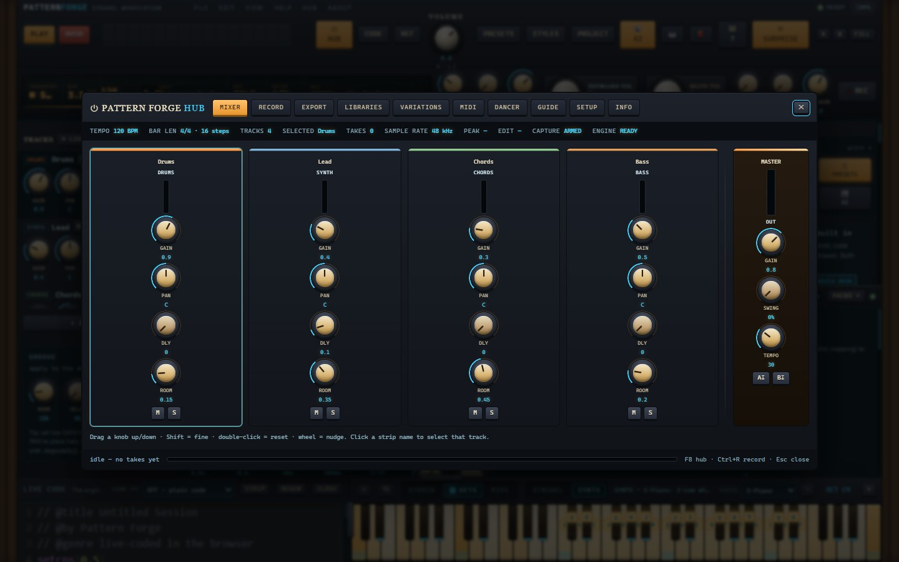
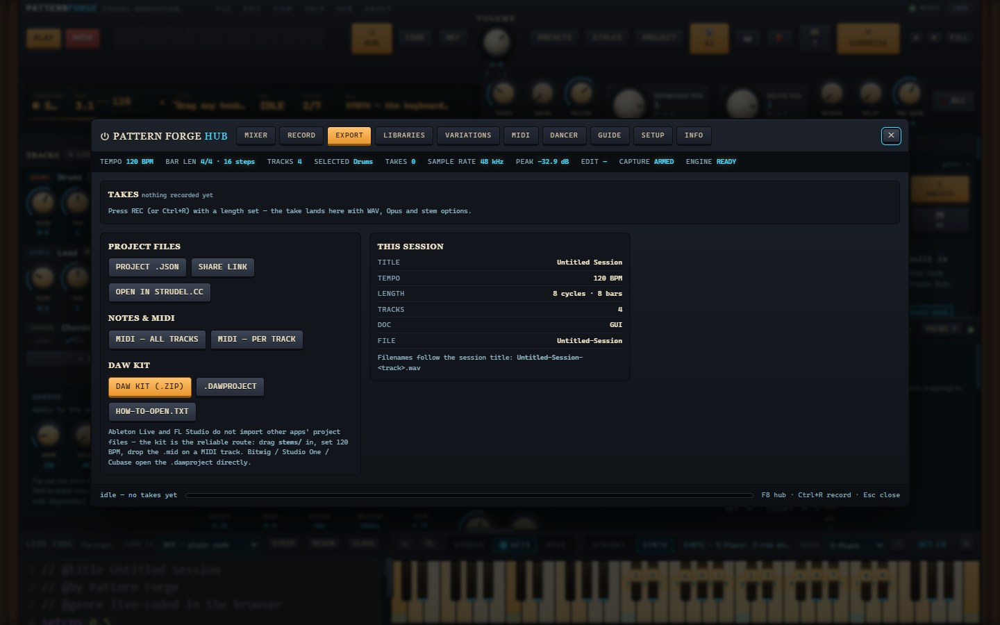
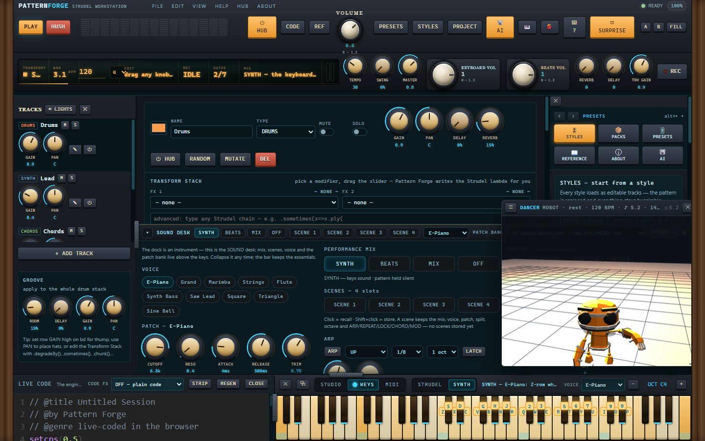

# Pattern Forge — a Strudel-powered music workstation (single-file web app)

Full GUI music-generation interface built on the [Strudel](https://strudel.cc) engine
(TidalCycles pattern language port to JavaScript, AGPL-3.0, codeberg.org/uzu/strudel).

**Designed, built and maintained by Modtech** (a.k.a. **Moddy**) — an original work: over 26,000 lines of
hand-written HTML/CSS/JS in `src/`, no framework and no bundler beyond its own `build.py`.

- Live app: **https://moddys.net/forge/** (free, in the browser)
- Windows app: **the 1.0b beta** — download the installer from
  [moddys.net/moddys-downloads.html](https://moddys.net/moddys-downloads.html) or
  [Releases](https://github.com/ModdySwag/PatternForge/releases); each build ships with its
  corresponding source.
- GitHub: **https://github.com/ModdySwag**
- Correspondence: **modtech@gmail.com**
- © 2026 Modtech (Moddy) — free software under the **GNU AGPL-3.0-or-later** licence (see `LICENSE`);
  the Strudel engine it runs is credited in full below and in `THIRD-PARTY-NOTICES.md`.

The engine is loaded from `https://unpkg.com/@strudel/repl@1.3.0`, and it is the only piece of
third-party *code* the app runs. Everything the instrument is made of is self-contained in
`index.html`; what else comes over the wire at runtime is data and materials: the engine's own
sample maps (dough-samples, uzu-drumkit, todepond, felixroos soundfonts), the pack store at
https://moddys.net/packs/, `three@0.147.0` plus three GLB rigs from threejs.org for the dancer, and
— only if you switch Kody on — the OpenAI endpoint you configure.

## Screenshots

The Windows build, captured from the app itself:

## Files

- `index.html` — the app (double-click to open; a browser + internet connection needed for the engine)
- `build.py` — regenerates `index.html` from `src/` parts (python3 build.py)
- `src/` — sources: head.html, styles.css, body.html, app_data.js (presets + reference +
  transform/tuning/morph catalogs), styles_data.js (16 genres x 5 variations),
  app_codegen.js (GUI model → Strudel code), app_core.js (engine bridge/state), app_ui.js (rendering)
- `verify/cdp_smoke.mjs` — headless Chromium engine verification (node >= 21)
- `verify/cdp_layout.mjs` — headless Chromium layout/geometry verification
- `verify/codegen_test.mjs` — pure-logic codegen tests (no browser)
- `verify/cdp_shot.mjs` — captures UI screenshots to verify/shots/
- `verify/ryukau/*.js` — reference renderers from ryukau's UhhyouWebSynthesizers (Apache-2.0)

## What it does

- 7 track types: drum step grid, Euclidean sequencer, synth, sample player, chord/voicing,
  bass, raw code — all compiled live into real Strudel documents (`$:` patterns, `stack`,
  `struct`, euclidean mini-notation, `n()/scale()`, ADSR, filters, FM, chop/striate/splice...)
- Global transport: CPM/BPM (cycles per minute), swing, master gain, per-track delay/room
  sends on separate orbits, mute/solo (via `_$:`), hush
- Live CODE drawer: the actual Strudel document, editable (engine is @strudel/repl's
  strudel-editor web component), with error reporting
- Styles catalog: 16 genres x 5 variation presets (80 total), hideable STYLES tab with
  search + family accordion, SURPRISE random style, all presets fully editable GUI states
- Transform Stack: 26 structured modifiers with sliders (ply, degrade, crush, stut, jux,
  wobble, echo, off, sometimes, iter, chunk, fastChunk, zoom, linger, rev, palindrome,
  invert, inside, outside, superimpose, layer, often, rarely, almostAlways, someCycles,
  squeeze) + free-form chain
- Synth designer: waveform morph (spectral interpolation between two shapes), microtuning
  systems (equal / 5-limit just intonation / overtone 4-7 / overtone 8-15 / primes 2-11),
  FM operator (index, ratio, modulator wave), unison detune spread, filter type (LP/HP/BP),
  partials, LFO, vibrato, noise, texture FX (crush, coarse, vowel, distort, tremolo depth/shape),
  duck & space (sidechain duck orbit/attack/depth, per-voice room size), stepwise grid tools
  (repeat, halve, palindrome, reverse, rotate, octave/step transpose)
- Reference drawer: full Strudel API cheatsheet mined from the strudel.cc Learn section,
  including Conditional and Stepwise function groups, all click-to-copy
- Chords: play-chance humanization (random strum drops), arpeggiator, ireal voicings
- Scenes A/B capture/recall, FILL one-cycle roll, undo, keyboard shortcuts, beat-lights
  playhead, MIDI out (WebMIDI), sample map support (custom `samples()` URLs)
- MIDI panel (HUB → MIDI, Ctrl+Shift+I): one click asks the browser for Web MIDI (no sysex); the
  inputs and outputs it finds are listed with maker and connection state and refresh as you plug
  things in. **Play in**: notes from a hardware keyboard play the app's own voice through the exact
  path the 61-key dock uses, velocity included. **Route out**: a chip per track writes the engine's
  own `.midi('Device')` into that track's transform stack (or one MASTER line for everything), so
  the route is visible in the generated document and survives a save. A monitor shows the last
  messages each way — type, channel, data — capped and throttled so a MIDI clock cannot flood the
  page. No Web MIDI in the browser (Safari has none) means the panel says so and stops.
- Projects: localStorage autosave, .forge.json export/import, share links (state in URL hash)
- Randomizers: per-track random generation + "MUTATE" which applies random Strudel
  transformations (degradeBy, ply, off, echo, jux, chunk, mask, stut...)
- Pack Store (PACKS tab): free packs served from https://moddys.net/packs/ — 101 packs,
  1,854 patterns and 14 sound banks, every file sha256-checked against the store index before it
  installs. "Sample Lab" (20 original patterns on the engine's prebaked sample libraries — VCSL
  orchestral/melodic, Dirt-Samples textures, mridangam, deep-cut drum banks) and
  "Strudel-Box Classics" (8 MIT starter patterns from the strudel-box VS Code extension) are the
  first-party packs; the rest come from their authors and carry their licences.
  Install with sha256 verification, browse patterns, click to load into the live engine.
  Compat badges per pack. Store URL overridable via localStorage key `forge-store-url`.
- Sample library: 50+ new sounds in the SAMPLE picker (VCSL steinway/kawai pianos, sax,
  kalimba, marimba, timpani, tabla…) and 20 more drum machines in the DRUM BANK picker
  (Emu SP-12, Akai MPC60, TR-727, Oberheim DMX, Linn LM-1, Boss DR-110…) — all prebaked
  in the pinned engine, engine-verified per sound.
- Strudel.cc interchange: PROJECT → OPEN IN STRUDEL.CC sends the generated document to
  strudel.cc (same base64-hash scheme the strudel-box extension uses). Ctrl+. hush alias.

## Ideas adapted from the strudel-box VS Code extension (deep2universe, MIT)

The strudel-box extension (marketplace.visualstudio.com/items?itemName=deep2universe.strudel-box)
was fully dissected (VSIX sha256-verified against the marketplace, unpacked, webview audited).
Folded into Pattern Forge: its share-to-strudel.cc URL scheme, Ctrl+. hush shortcut, its
pre-loaded sample libraries (felixroos/dough-samples manifests — VCSL, Dirt-Samples,
mridangam, tidal-drum-machines, EmuSP12), and its README/example patterns as a pack.
Not adopted: its analyser visualizer (window.strudel.analysers is absent from the
@strudel/repl bundle — the extension gets it from @strudel/web) and its VSCode themes.

## Ideas adapted from UhhyouWebSynthesizers (ryukau)

- Waveform Morph — SquareMorph's spectral morphing (Walsh-Hadamard), realized as harmonic-
  amplitude interpolation between two shapes via additive `.partials()`
- Tuning systems — IntegerChord's 5-limit just intonation and GlitchSprinkler's octave-wrapped
  overtone/prime pitch sets, emitted as `.detune()` cent offsets and exact-ratio `.freq()` patterns
- FM layer — FMTechnoBass2 / FMGlassyPad style FM index/ratio/waveform controls
- Unison spread + chord play-chance — IntegerChord unison detune and GlitchSprinkler rest chance

## Kody — the AI koala (🐨 AI tab)

A conversational AI pattern generator living in the sidebar. The prompt system adapts
Nicholas Griffin's strudel app prompt architecture (nicholasgriffintn/ai-platform,
Apache-2.0: persona base prompt + per-style guides + complexity guides + worked examples,
blog: nicholasgriffin.dev/blog/creating-strudel-live-coding-patterns-with-ai/), improved
with the one thing his blog says his prompt lacked: the full engine inventory. Kody's
system prompt is built from the app's live data arrays, so it can only name drum banks,
samples, waveforms, scales and functions that actually exist and are engine-verified here.

- Natural chat: describe a vibe ("a rainy lo-fi beat with soft piano and vinyl crackle,
  84 bpm") — Kody replies with a chat line + one runnable Strudel expression.
- STYLE chips (his 8 style guides) and DENSITY chips (his 3 complexity guides) steer it.
- BPM anywhere in your prompt → a "SET n BPM" chip applies it to the transport
  (cpm = BPM/4 — the verified tempo rule). .cpm()/setcps() calls in generated code are
  stripped and converted to that chip instead.
- Every reply lands as a code card: PLAY (preview), + TRACK (load as a real GUI track to
  keep tweaking), COPY, CC (open in strudel.cc). If the engine rejects it, ASK KODY TO FIX
  sends the code + the exact engine error back for a corrected take.
- Works keyless: with no API key, Kody runs a seeded offline improviser (same words,
  same groove — deterministic) built from verified constructs. ⚙ connects any
  OpenAI-compatible endpoint (OpenAI, DeepSeek, OpenRouter, Ollama…); the key never
  leaves your browser except to that endpoint.
- The koala itself is alive: it breathes at idle, chews its leaf while thinking, bobs on
  the beat in sync with the scheduler while the music plays, droops its ears on engine
  errors, and falls asleep when the session goes quiet.

## The keyboard (press ?)

Every function has a key — a full DAW-style keymap, dispensed through a single
central dispatcher. Single letters work whenever you're not typing; Ctrl-combos work
everywhere. `?` opens Kody's keymap overlay — searchable, grouped, and it is the same
table the dispatcher runs from, so it can never lie.

- Transport: SPACE play · H hush · Ctrl+. hush · E / Ctrl+Enter evaluate · F fill
  · Ctrl+S save · Ctrl+Shift+C share · Ctrl+K live-code drawer · S surprise
- Tabs: G styles · K packs · P presets · R reference · I about · J project · A Kody
  (F-keys cover the panels: F6 Kody, F7 project — F1 is the help overlay)
- Tracks: 1-9 select · ↑/↓ previous/next · M mute · X solo · N new · DEL remove
  · D dice · Shift+D dice the band · Ctrl+Z undo · Ctrl+↑/↓ octave the pattern
- Tempo: +/− nudge cpm · Shift++/Shift+− jump 5 (BPM = cpm × 4)
- View: V side panel · L track list · B beat lights · / jump to Kody's chat · Y piano dock
  · F9/F10 scenes (Shift+capture) · Ctrl+Shift+I MIDI panel · Ctrl+Shift+A dancer

Kody teaches the keys as you use them: the first press of any shortcut pops his
speech bubble with a one-line explainer. He also answers "how do I…" questions
offline from a built-in UI knowledge base, and the keymap table doubles as his
reference — ask him, press ?, or just poke around; all three agree.

## The piano dock (press Y)

A full 61-key MIDI-style keyboard (C2–C7) docked at the bottom of the screen:
click a key to play it into the engine, hold to sustain, glide across for sweeps —
held notes stack into chords on top of whatever is playing. Keys in the selected
track's scale glow amber with the root highlighted.

Open the live-code drawer (Ctrl+K) and the bottom row splits: the code stays on the
left, the piano fills the right at the drawer's full height — watch the keys stretch
into proper piano proportions. Close the drawer and the dock compacts back across
the whole floor. Y (or the topbar 🎹 button) hides and shows the whole dock.

Press ` (or the ARM switch on the dock) and your typing keys become piano keys,
Ableton-style: the A-row plays the white keys (A = C), the W-row the black ones
(W = C♯), Z / X hop octaves, and the letters are printed right on the keys so the
mapping is always visible. Esc hands the keyboard back to the workstation.
The little − OCT + readout (also [ and ]) slides the lit keycap window across all
five octaves. As the pane narrows, the dock sheds its labels first, then its keycaps
— the keys always fit.

## Hardware Forge theme

The interface blends two classic instrument designs: the Minimoog's walnut end-cheeks,
dark steel control panel, cream plate labels, keycap buttons and fader knobs
(stevebarakat/Minimoog, minimoog.app), with the bright colour-coded, playful spirit of
Playtronica's DX7 — amber LEDs, rocker chips, and the 61-key walnut-and-ivory piano dock at the bottom of the screen
that highlights the selected track's scale and previews notes straight into the engine.

## License note

**Pattern Forge © 2026 Modtech (a.k.a. Moddy)** — modtech@gmail.com · [github.com/ModdySwag](https://github.com/ModdySwag) · [moddys.net](https://moddys.net)

Pattern Forge is free software under the GNU AGPL-3.0-or-later (see `LICENSE`). That is a deliberate choice, not an
obligation: the project is not a
fork of Strudel and ships none of its code — the engine is fetched at runtime from `unpkg.com/@strudel/repl@1.3.0`
and used unmodified through its public API. The licence keeps the whole instrument, including anything built on
top of it, open in the same spirit as the tools it learned from.
Nothing third-party is redistributed inside `index.html`; the full fetched-at-runtime and influence list is in
`THIRD-PARTY-NOTICES.md`.
Strudel copyright: Felix Roos, Alex McLean and the Strudel contributors.
Ryukau reference material: UhhyouWebSynthesizers, Apache-2.0, Takamitsu Endo.

## Verification

Six suites, all run headless:

1. `node verify/codegen_test.mjs` — pure-logic: builds Strudel documents from GUI states and
   asserts structure (mute/solo `_$:` prefixes, euclidean mini-notation, chord arp mode,
   amen chop branch, colon scale syntax, raw passthrough, swing/master `all()`, transform
   slots, fill roll, MIDI chain, waveform morph math, tuning emission, FM/unison/chance,
   learn-section FX chain, transform catalog). 281 checks.
2. `node verify/cdp_smoke.mjs` — temporary-profile headless Chromium: engine prebake, zero
   boot errors, GUI preset + play press (scheduler must start), every raw-code preset and
   sample style evaluated clean, Ryukau-adapted DSP constructs evaluated in the real engine,
   generated-document shape, share-link round-trip, fill, surprise, pack store (tab renders,
   fetch failure degrades, mocked install + browse + pattern load). Exits non-zero on failure.
3. `node verify/cdp_layout.mjs` — geometry: 1600x950 viewport, no overflow, column widths,
   drum grid cells in 16-column rows, 8x16 note grid, strum grid, code drawer visible,
   preset/styles/packs/reference sidebar content, beat lights, playhead running.
4. `node verify/cdp_store.mjs` — the pack store end-to-end: serves the REAL deploy/packs
   folder over local HTTP with CORS, installs a pack through the live store UI (sha256
   verified), browses and loads a pattern into the engine.
5. `node verify/verify_packs.mjs` — evaluates EVERY pack pattern in the real engine and
   writes per-pattern compat into the pack files + compat.json + index.json (last run:
   136/136 ok, zero errors).
6. `node verify/cdp_shot.mjs` saves UI screenshots to verify/shots/ for eyeballing
   (08-pack-store.png shows the live store).

Node 21+ required (global fetch/WebSocket).

## Kody speaks, and the desk moves

Kody is no longer text-only.

* **Voice on/off** — the **VOICE** button in Kody's panel, or `Ctrl+Shift+V`, and he reads his answers out loud. Works with
  no key at all (browser speech). Switch **TALKS VIA → API** in his ⚙ and any OpenAI-compatible endpoint that serves
  `/audio/speech` takes over — OpenAI, a local gateway, LocalAI, an agent that speaks HTTP.
* **Talk instead of typing** — the **TALK** button, or `Ctrl+Shift+M`, opens the microphone; press again and the words land
  in the composer and go straight to Kody like any typed message. Browser listening (Chrome/Edge) needs no key; **LISTENS VIA
  → API** routes it through `/audio/transcriptions` instead.
* The side-panel tabs are a **keypad** now: icon + full label, no truncation, with a crumb that says where you are.

Everything on the desk resizes and folds, and it remembers:

| Pull this | You get |
|---|---|
| bottom band (grip on its top edge) | resize the code view **and** the keyboard together; pull it right down and it folds to a rail (`Ctrl+Shift+D`) |
| side panel edge | sidebar width |
| track-list edge | track-list width |
| code-view right edge | code-view width |
| `Alt+←` / `Alt+→` or the `‹` `›` buttons | back / forward through the panels you visited |

Sizes and widths are saved per browser, so the desk is how you left it next time.

## The knobs, the hub and the record button

Every continuous control in Pattern Forge is now a rotary knob — click and drag **up or down**
(up is more), Shift for fine, wheel to nudge one step, double-click to snap back to the default,
or use the arrow keys once a knob has focus. Tempo, swing, master, reverb, delay and the selected
track's gain sit on the strip under the top bar; the amber display next to them always tells you
which knob you are holding and what its value is.

The hub is the control room — **F8**, or the ⏻ HUB button in the track header:

* **MIXER** — one strip per track (colour chip, live meter, gain/pan/delay/room knobs, M/S) plus a
  master strip set apart at the right.
* **RECORD** — master take or stems, length in cycles, count-in, format. **Ctrl+R** starts and stops;
  the recording rolls in on the next bar line and stops itself at the length you chose.
* **EXPORT** — takes as WAV 16 / 24 / 32-float or Opus, MIDI (all tracks or per track), a
  `.dawproject` for Bitwig/Studio One/Cubase, and a **DAW KIT (.ZIP)** built for Ableton Live and
  FL Studio: bar-aligned stems + a multi-track `.mid` + the project + HOW-TO-OPEN.txt.
* **GUIDE** — Kody's seven-step workflow (vibe → beat → notes → sound → mix → record → save) that
  ticks itself off as you work.
* **MIDI** — the hardware desk (**Ctrl+Shift+I**). ENABLE asks the browser once; then a hardware
  keyboard plays the instrument's own voice, any track can be sent to your gear with the engine's
  `.midi('Device')` control, and the monitor shows both directions with counters. See
  *The knobs, the hub and the record button* above for what a route does to the document.
* **SETUP / INFO** — record defaults, view switches, pack store, session facts and shortcuts.

Stems: **Ctrl+Shift+R**. Save everything at once: **Ctrl+Shift+E**. Everything you record stays in
the EXPORT tab as a take, ready to save again in another format — and the first finished take saves
itself, like a phone camera roll.

Then the verification pass: `node verify/codegen_test.mjs` (281 checks), `node verify/cdp_layout.mjs`
(geometry) and `node verify/cdp_hub.mjs` (knob maths in a real browser, LCD, mixer, a real recording
saved to disk, stems, MIDI, DAW kit — 42 checks).
